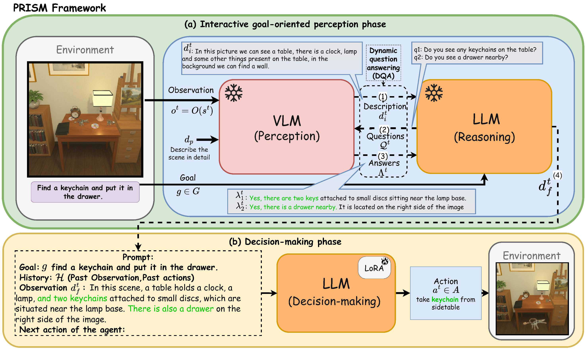

# PRISM: Perception-Reasoning Interleaved for Sequential Decision-Making

This repository contains the official implementation of **PRISM**, a framework that interleaves perception and reasoning for sequential decision-making tasks.

---



---

## 📦 Release Checklist

| Item | Status |
|------|--------|
| 💻 Release Code | ☐ |
| 🗂️ Release Dataset | ☐ |
| ⚖️ Release Weights | ☐ |

---

## 📄 Citation

If you use PRISM in your research, please cite:

```bibtex
@misc{aissi2026prismperceptionreasoninginterleaved,
      title={PRISM: Perception Reasoning Interleaved for Sequential Decision Making}, 
      author={Mohamed Salim Aissi and Clemence Grislain and Clement Romac and Laure Soulier and Mohamed Chetouani and Olivier Sigaud and Nicolas Thome},
      year={2026},
      eprint={2605.05407},
      archivePrefix={arXiv},
      primaryClass={cs.AI},
      url={https://arxiv.org/abs/2605.05407}, 
}
```


